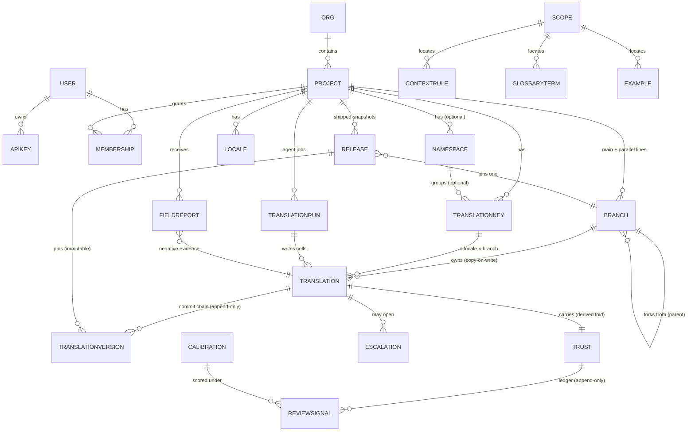
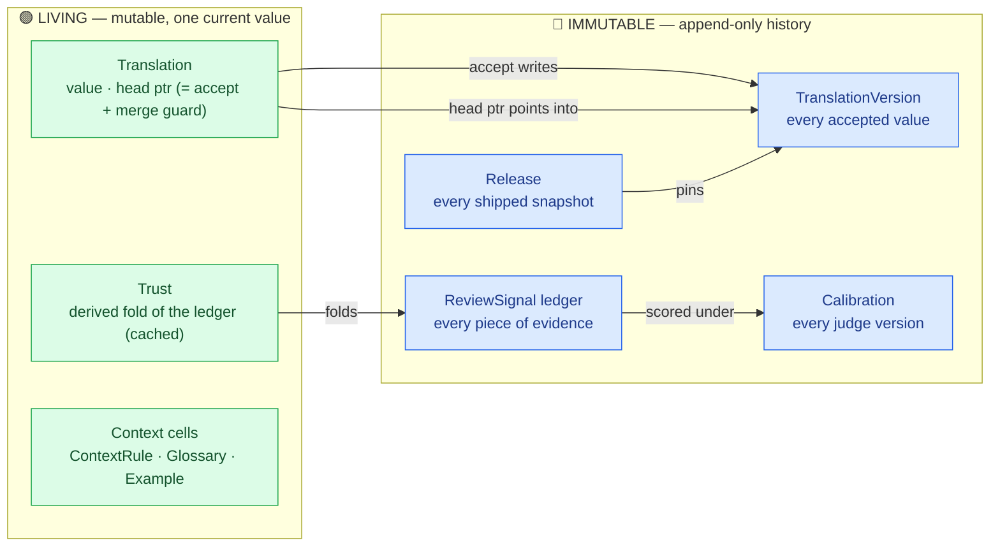
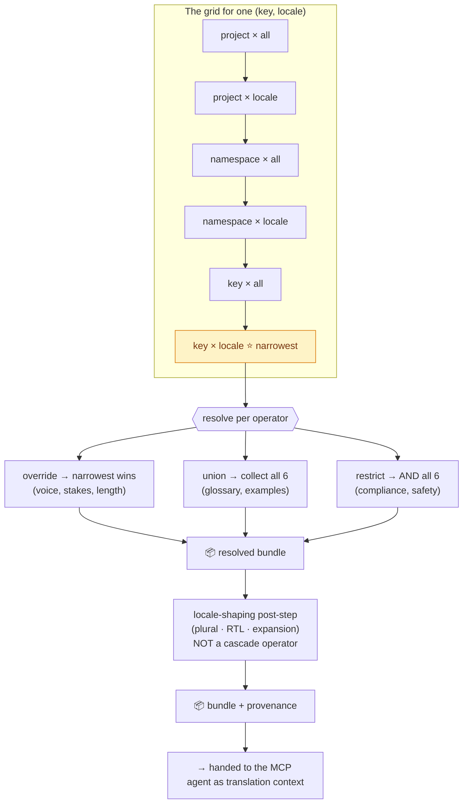
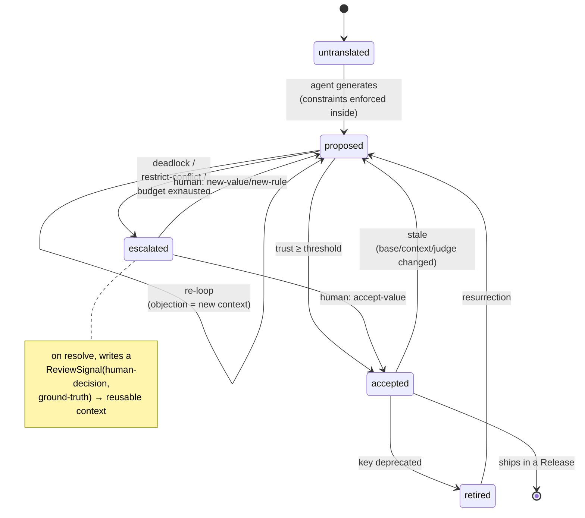
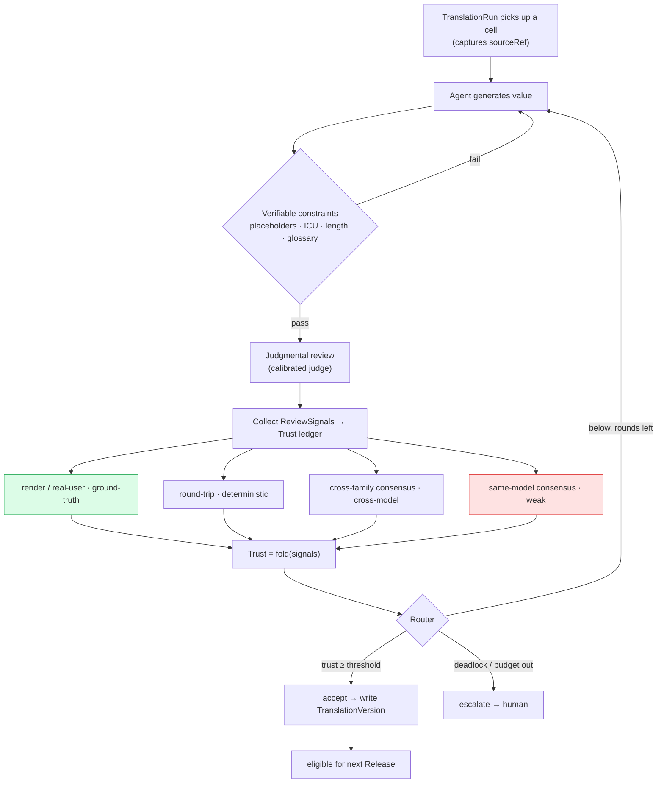
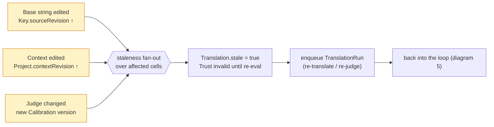
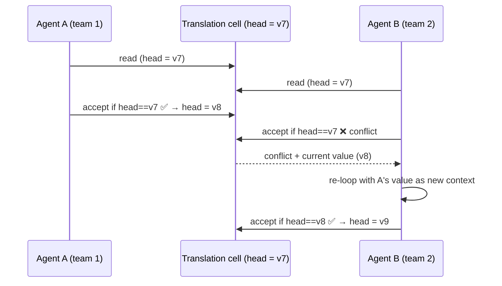
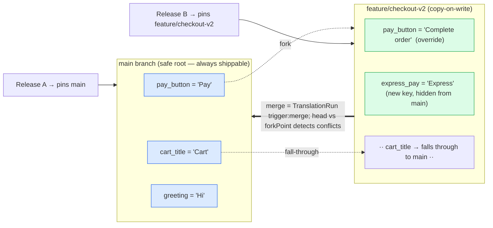

# Turjuman data model — diagrams

Visual companion to `data-model-redesign.md`. Each diagram answers one question. They're
Mermaid, so they render on GitHub and in any Mermaid viewer.

---

## 1. The whole map (entity-relationship)

Who points at whom. Attributes trimmed to the identifying few — see the design doc for full
fields.

> `SCOPE { projectId, namespace?, keyId?, locale? }` is a value object, not a row — every
> context entity embeds one, which is how a single ContextRule / GlossaryTerm / Example can live
> at any cell of the grid. (Voice, length, stakes, compliance, and the review-policy knobs are all
> `ContextRule` kinds; Trust and ReviewRound are derived, so they aren't drawn as base entities.)

---

## 2. The root principle, made visible

The model splits into **living/mutable** (one current value, changes in place) and
**immutable/historical** (append-only, never rewritten). This split is the whole point.

> "Approved" is **not** a mutable slot you overwrite — it's a pointer into immutable history.
> "Live" is **not** a per-cell flag — it's the latest Release. Trust **is** the fold of its
> ledger, so recalibrating is a re-fold, never a destructive rewrite.

---

## 3. The context cascade (how one string's context is resolved)

Context is a grid: scope tiers nested vertically, locale orthogonal across them. Resolution
walks the 6-cell ladder per merge-operator.

> Narrowest-wins is only the **override** rule; glossary *unions*, compliance *restricts* — the
> operator is a property of the context **type**, not the tier. Three folds, then a separate
> locale-shaping post-step (plural/RTL/expansion is *not* a cascade operator). A cross-tier
> override is logged in provenance and *raises review depth*.

---

## 4. One translation's lifecycle (the review router)

Review is a **router with three exits**, not a one-way approval gate. Cheap re-translation
means most "failures" loop back in with the objection as new context.

> The human is the **terminal** exit, used only for irreducible judgment — and even then the
> decision becomes a ground-truth signal that feeds future loops. Verifiable rules
> (placeholders, ICU, length) never reach this machine; they're enforced *during* generation.

---

## 5. One loop iteration (where trust comes from)

How a single cell goes from "agent produced a string" to "we trust it enough to ship",
and where each independence-ranked signal enters.

> Signals are ranked by **independence**: a real UI render outranks a deterministic check,
> which outranks cross-family model disagreement, which outranks same-model consensus
> (≈ measures stability, not correctness). Depth (how many signals you bother to collect) is
> set by the string's **stakes**.

---

## 6. Staleness — one fan-out, three triggers

Three different changes can invalidate a translation; they all feed **one** invalidation
path. Build it once.

> Each trigger is detected by comparing a stored stamp on the Translation against the current
> one: `sourceRef` vs `Key.sourceRevision`, `contextRevisionAtEval` vs
> `Project.contextRevision`, `calibrationRef` vs the active Calibration.

---

## 7. Concurrency (why nothing gets lost when teams collide)

> Accept is a **compare-and-swap on `head`** (the cell's pointer to its latest commit) — no
> separate lock integer. The loser doesn't fail, it **re-enters the loop** informed by the
> winner's value. A run also holds `lockedByRunId` so two runs don't fight over the same draft.

---

## 8. Branching — one concept for variants, experiments & feature flags

`main` is the safe root. A branch is a **copy-on-write** overlay: it stores only the cells it
touches and falls through to its parent for everything else. Selection of what ships happens at
the **Release/export edge**, not on the key.

> **A/B testing** = two long-lived branches (`exp-a`, `exp-b`), each with its own value; deploy
> both Releases and let the pipeline route traffic. **Feature flag / unreleased** = a branch that
> isn't pinned by any production Release yet. **Safe experiment** = branch, try, then merge or
> abandon — `main` never moved. One mechanism; the old `TranslationVariant` and `FeatureBundle`
> ideas are gone.

## How to read these together

- **Diagram 1** is the static map; **2** is the one idea everything rests on.
- **3** is what happens *before* a translation (assemble context); **4–5** are the
  translation/review loop itself; **6–7** are the forces that push cells *back* into that loop.
- Everything funnels to one place: a cell becomes an immutable **TranslationVersion**, which a
  **Release** pins — and that, not any mutable flag, is what "shipped" means.
